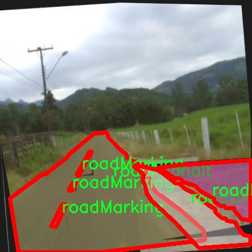

# 道路缺陷分割系统： yolov8-seg-goldyolo

### 1.研究背景与意义

[参考博客](https://gitee.com/YOLOv8_YOLOv11_Segmentation_Studio/projects)

[博客来源](https://kdocs.cn/l/cszuIiCKVNis)

研究背景与意义

随着城市化进程的加快，交通基础设施的建设与维护变得愈发重要。道路作为城市交通的主要载体，其质量直接影响到人们的出行安全与生活质量。然而，随着时间的推移和交通负荷的增加，道路表面不可避免地出现各种缺陷，如裂缝、坑洞、路面不平等问题。这些缺陷不仅影响了道路的使用寿命，还可能导致交通事故的发生。因此，及时、准确地识别和修复道路缺陷，成为了城市管理者和交通工程师面临的重要任务。

传统的道路缺陷检测方法多依赖人工巡查和经验判断，效率低下且容易受到主观因素的影响。近年来，随着计算机视觉和深度学习技术的迅猛发展，基于图像处理的自动化道路缺陷检测方法逐渐兴起。其中，YOLO（You Only Look Once）系列模型因其高效的实时检测能力而备受关注。YOLOv8作为该系列的最新版本，具备更强的特征提取能力和更快的推理速度，为道路缺陷的自动化检测提供了新的可能性。

本研究旨在基于改进的YOLOv8模型，构建一个高效的道路缺陷分割系统。我们使用的数据集包含1700张图像，涵盖了11种不同的道路缺陷类别，包括猫眼、裂缝、补丁、坑洞、路面沥青、路面标线、铺装路面、非铺装路面、减速带、雨水井和水洼。这些类别的多样性为模型的训练提供了丰富的样本，使其能够在复杂的道路环境中实现高精度的缺陷识别与分割。

在技术层面上，YOLOv8模型的改进主要体现在网络结构的优化和损失函数的调整上，以提高对小目标和复杂背景的识别能力。此外，针对道路缺陷的特性，我们还将引入数据增强技术，以增加训练样本的多样性，从而提升模型的泛化能力。这一系列改进措施将有助于提升道路缺陷检测的准确性和效率，进而为城市道路的维护提供科学依据。

从社会意义上看，构建高效的道路缺陷分割系统，不仅能够提高道路维护的效率，降低人工成本，还能有效减少因道路缺陷导致的交通事故，保障行车安全。同时，该系统的推广应用也将推动智能交通系统的发展，为城市交通管理提供更为先进的技术支持。通过实时监测和分析道路状况，城市管理者能够更好地制定维护计划，优化资源配置，实现可持续发展的目标。

综上所述，基于改进YOLOv8的道路缺陷分割系统的研究，不仅具有重要的学术价值，还有着广泛的应用前景。它将为道路缺陷的自动化检测提供新的思路和方法，推动交通基础设施的智能化发展，为构建安全、便捷的城市交通环境贡献力量。

### 2.图片演示


注意：本项目提供完整的训练源码数据集和训练教程,由于此博客编辑较早,暂不提供权重文件（best.pt）,需要按照6.训练教程进行训练后实现上图效果。

### 3.视频演示

[3.1 视频演示](https://www.bilibili.com/video/BV1cczGYuEpp/)

### 4.数据集信息

##### 4.1 数据集类别数＆类别名

nc: 11
names: ['catsEye', 'craks', 'patchs', 'pothole', 'roadAsphalt', 'roadMarking', 'roadPaved', 'roadUnpaved', 'speedBump', 'stormDrain', 'waterPuddle']


##### 4.2 数据集信息简介

数据集信息展示

在现代智能交通系统的研究中，准确识别和分割道路缺陷是提升行车安全和道路维护效率的关键环节。为此，我们构建了一个名为“Falls”的数据集，旨在为改进YOLOv8-seg的道路缺陷分割系统提供高质量的训练数据。该数据集包含11个类别，涵盖了多种常见的道路缺陷和标识，确保模型能够在多样化的环境中有效识别和分割这些目标。

“Falls”数据集的类别设计经过精心挑选，旨在反映现实世界中可能遇到的各种道路状况。具体而言，数据集中包括“catsEye”（猫眼）、“craks”（裂缝）、“patchs”（修补）、“pothole”（坑洞）、“roadAsphalt”（沥青路面）、“roadMarking”（路面标线）、“roadPaved”（铺装路面）、“roadUnpaved”（非铺装路面）、“speedBump”（减速带）、“stormDrain”（雨水排水口）和“waterPuddle”（水洼）等11个类别。这些类别不仅涵盖了道路表面常见的缺陷类型，还包括了一些重要的交通设施，能够为模型提供丰富的上下文信息。

在数据集的构建过程中，我们注重数据的多样性和代表性，确保每个类别的样本都能反映出不同的环境条件和使用场景。例如，在“pothole”类别中，我们收集了不同大小、形状和深度的坑洞图像，以便模型能够学习到各种坑洞的特征。在“roadMarking”类别中，我们则考虑了不同的标线样式和磨损程度，确保模型在实际应用中能够准确识别各种路面标线。

此外，为了提高模型的泛化能力，数据集中的图像来自于不同的地理位置和气候条件。这种多样性使得模型在面对不同城市、乡村或山区的道路时，能够保持较高的识别准确率。我们还特别关注了数据集的标注质量，所有图像均经过专业人员的精确标注，确保每个缺陷和交通设施的边界清晰可辨。

“Falls”数据集不仅为YOLOv8-seg的训练提供了丰富的样本，还为后续的模型评估和优化奠定了基础。通过在这个数据集上进行训练，模型能够学习到道路缺陷的多样性和复杂性，从而在实际应用中更好地执行分割任务。随着智能交通技术的不断发展，我们相信“Falls”数据集将为道路安全和维护提供重要的支持，推动相关研究的深入开展。

总之，“Falls”数据集以其丰富的类别和高质量的标注，为改进YOLOv8-seg的道路缺陷分割系统提供了坚实的基础。通过对这一数据集的深入研究和应用，我们期待能够在道路安全监测和维护领域取得显著的进展，为构建更加安全、高效的交通环境贡献力量。




### 5.项目依赖环境部署教程（零基础手把手教学）

[5.1 环境部署教程链接（零基础手把手教学）](https://www.bilibili.com/video/BV1jG4Ve4E9t/?vd_source=bc9aec86d164b67a7004b996143742dc)


[5.2 安装Python虚拟环境创建和依赖库安装视频教程链接（零基础手把手教学）](https://www.bilibili.com/video/BV1nA4VeYEze/?vd_source=bc9aec86d164b67a7004b996143742dc)

### 6.手把手YOLOV8-seg训练视频教程（零基础手把手教学）

[6.1 手把手YOLOV8-seg训练视频教程（零基础小白有手就能学会）](https://www.bilibili.com/video/BV1cA4VeYETe/?vd_source=bc9aec86d164b67a7004b996143742dc)


按照上面的训练视频教程链接加载项目提供的数据集，运行train.py即可开始训练



     Epoch   gpu_mem       box       obj       cls    labels  img_size
     1/200     0G   0.01576   0.01955  0.007536        22      1280: 100%|██████████| 849/849 [14:42<00:00,  1.04s/it]
               Class     Images     Labels          P          R     mAP@.5 mAP@.5:.95: 100%|██████████| 213/213 [01:14<00:00,  2.87it/s]
                 all       3395      17314      0.994      0.957      0.0957      0.0843

     Epoch   gpu_mem       box       obj       cls    labels  img_size
     2/200     0G   0.01578   0.01923  0.007006        22      1280: 100%|██████████| 849/849 [14:44<00:00,  1.04s/it]
               Class     Images     Labels          P          R     mAP@.5 mAP@.5:.95: 100%|██████████| 213/213 [01:12<00:00,  2.95it/s]
                 all       3395      17314      0.996      0.956      0.0957      0.0845

     Epoch   gpu_mem       box       obj       cls    labels  img_size
     3/200     0G   0.01561    0.0191  0.006895        27      1280: 100%|██████████| 849/849 [10:56<00:00,  1.29it/s]
               Class     Images     Labels          P          R     mAP@.5 mAP@.5:.95: 100%|███████   | 187/213 [00:52<00:00,  4.04it/s]
                 all       3395      17314      0.996      0.957      0.0957      0.0845


### 7.50+种全套YOLOV8-seg创新点加载调参实验视频教程（一键加载写好的改进模型的配置文件）

[7.1 50+种全套YOLOV8-seg创新点加载调参实验视频教程（一键加载写好的改进模型的配置文件）](https://www.bilibili.com/video/BV1Hw4VePEXv/?vd_source=bc9aec86d164b67a7004b996143742dc)

### YOLOV8-seg算法简介

原始YOLOv8-seg算法原理

YOLOv8-seg算法是YOLO系列目标检测算法的最新迭代，继承了前几代算法的优点，并在此基础上进行了多方面的优化与改进。该算法的核心在于其高效的网络结构和先进的特征提取与融合技术，使得其在目标检测和分割任务中表现出色。YOLOv8-seg的设计理念是通过轻量化和模块化的方式，提升模型的性能与适应性，同时保持较低的计算复杂度，以便于在各种设备上进行快速部署。

YOLOv8-seg的网络结构主要由三个部分组成：Backbone、Neck和Head。Backbone部分负责特征提取，采用了一系列卷积和反卷积层，以便从输入图像中提取出丰富的特征信息。具体而言，YOLOv8-seg使用了C2模块作为基本构成单元，这一模块通过引入残差连接和瓶颈结构，显著减小了网络的参数量，同时提高了特征提取的效率。该部分的设计灵活多变，能够根据不同的任务需求调整网络的深度和宽度，从而实现对不同规模目标的有效检测。

在Backbone部分之后，Neck部分则采用了多尺度特征融合技术，旨在将来自不同阶段的特征图进行有效整合。通过这种方式，YOLOv8-seg能够更好地捕捉到不同尺度目标的信息，提升了模型的鲁棒性和检测性能。Neck部分结合了特征金字塔网络（FPN）和路径聚合网络（PAN），使得特征融合过程更加高效，能够在不同层次上实现信息的交互与融合，从而增强了模型对复杂场景的适应能力。

YOLOv8-seg的Head部分负责最终的目标检测和分割任务。与传统的耦合检测头不同，YOLOv8-seg采用了解耦头结构，将分类和定位任务分开处理。具体而言，Head部分设有多个检测头，每个检测头专注于不同尺寸的信息提取。通过这种解耦设计，YOLOv8-seg能够更精确地进行目标的分类与定位，提高了检测的准确性。此外，YOLOv8-seg在检测头中引入了轻量化的解耦结构，进一步降低了计算复杂度，使得模型在处理速度和精度之间达到了良好的平衡。

在数据预处理方面，YOLOv8-seg继承了YOLOv5的策略，采用了多种数据增强手段，如马赛克增强、混合增强、空间扰动和颜色扰动等。这些增强技术不仅提高了模型的泛化能力，还增强了其对复杂场景的适应性。通过这些数据预处理策略，YOLOv8-seg能够在训练过程中有效地提升模型的性能，确保其在真实场景中的应用效果。

值得一提的是，YOLOv8-seg在标签分配策略上也进行了创新。与YOLOv5的候选框聚类策略不同，YOLOv8-seg采用了动态标签分配策略，这种策略能够根据目标的实际分布情况，灵活调整正负样本的匹配方式。具体而言，YOLOv8-seg使用了Varifocal Loss作为分类损失函数，该损失函数通过对正负样本进行不对称加权，使得模型在训练过程中能够更加关注高质量的正样本，从而提升整体的检测性能。

总的来说，YOLOv8-seg算法通过一系列的创新与优化，成功地将目标检测与分割任务结合在一起，形成了一种高效、灵活且具有强大性能的解决方案。其轻量化的设计理念和模块化的网络结构，使得YOLOv8-seg在各种应用场景中都能表现出色，成为计算机视觉领域中一个重要的研究方向。随着YOLOv8-seg的不断发展与完善，未来在智能监控、自动驾驶、无人机等领域的应用前景将更加广阔。


### 9.系统功能展示（检测对象为举例，实际内容以本项目数据集为准）

图9.1.系统支持检测结果表格显示

  图9.2.系统支持置信度和IOU阈值手动调节

  图9.3.系统支持自定义加载权重文件best.pt(需要你通过步骤5中训练获得)

  图9.4.系统支持摄像头实时识别

  图9.5.系统支持图片识别

  图9.6.系统支持视频识别

  图9.7.系统支持识别结果文件自动保存

  图9.8.系统支持Excel导出检测结果数据


### 10.50+种全套YOLOV8-seg创新点原理讲解（非科班也可以轻松写刊发刊，V11版本正在科研待更新）

#### 10.1 由于篇幅限制，每个创新点的具体原理讲解就不一一展开，具体见下列网址中的创新点对应子项目的技术原理博客网址【Blog】：


[10.1 50+种全套YOLOV8-seg创新点原理讲解链接](https://gitee.com/qunmasj/good)

#### 10.2 部分改进模块原理讲解(完整的改进原理见上图和技术博客链接)【如果此小节的图加载失败可以通过CSDN或者Github搜索该博客的标题访问原始博客，原始博客图片显示正常】

### YOLOv8简介
YOLOv8是一种目标检测模型，是基于YOLO (You Only Look Once)系列算法发展而来的最新版本。它的核心思想是将目标检测任务转化为一个回归问题，通过单次前向传播即可直接预测出图像中的多个目标的位置和类别。
YOLOv8的网络结构采用了Darknet作为其主干网络，主要由卷积层和池化层构成。与之前的版本相比，YOLOv8在网络结构上进行了改进，引入了更多的卷积层和残差模块，以提高模型的准确性和鲁棒性。
YOLOv8采用了一种特征金字塔网络(Feature Pyramid Network,FPN)的结构，通过在不同层级上融合多尺度的特征信息，可以对不同尺度的目标进行有效的检测。此外，YOLOv8还引入了一种自适应感知域(Adaptive Anchors
的机制，通过自适应地学习目标的尺度和
长宽比，提高了模型对于不同尺度和形状目标的检测效果。
总体来说，YOLOv8结构模型综合了多个先进的目标检测技术，在保证检测速度的同时提升了检测精度和鲁棒性，被广泛应用于实时目标检测任务中。


#### yolov8网络模型结构图

YOLOv8 (You Only Look Once version 8)是一种目标检测算法，它在实时场景下可以快速准确地检测图像中的目标。
YOLOv8的网络模型结构基于Darknet框架，由一系列卷积层、池化层和全连接层组成。主要包含以下几个组件:
1.输入层:接收输入图像。
2.卷积层:使用不同尺寸的卷积核来提取图像特征。
3.残差块(Residual blocks):通过使用跳跃连接(skip connections）来解决梯度消失问题，使得网络更容易训练。
4.上采样层(Upsample layers):通过插值操作将特征图的尺寸放大，以便在不同尺度上进行目标检测。
5.池化层:用于减小特征图的尺寸，同时保留重要的特征。
6.1x1卷积层:用于降低通道数，减少网络参数量。
7.3x3卷积层:用于进—步提取和组合特征。
8.全连接层:用于最后的目标分类和定位。
YOLOv8的网络结构采用了多个不同尺度的特征图来检测不同大小的目标，从而提高了目标检测的准确性和多尺度性能。
请注意，YOLOv8网络模型结构图的具体细节可能因YOLO版本和实现方式而有所不同。


#### yolov8模型结构
YOLOv8模型是一种目标检测模型，其结构是基于YOLOv3模型进行改进的。模型结构可以分为主干网络和检测头两个部分。
主干网络是一种由Darknet-53构成的卷积神经网络。Darknet-53是一个经过多层卷积和残差连接构建起来的深度神经网络。它能够提取图像的特征信息，并将这些信息传递给检测头。
检测头是YOLOv8的关键部分，它负责在图像中定位和识别目标。检测头由一系列卷积层和全连接层组成。在每个检测头中，会生成一组锚框，并针对每个锚框预测目标的类别和位置信息。
YOLOv8模型使用了预训练的权重，其中在COCO数据集上进行了训练。这意味着该模型已经通过大规模数据集的学习，具有一定的目标检测能力。

### RT-DETR骨干网络HGNetv2简介
#### RT-DETR横空出世
前几天被百度的RT-DETR刷屏，参考该博客提出的目标检测新范式对原始DETR的网络结构进行了调整和优化，以提高计算速度和减小模型大小。这包括使用更轻量级的基础网络和调整Transformer结构。并且，摒弃了nms处理的detr结构与传统的物体检测方法相比，不仅训练是端到端的，检测也能端到端，这意味着整个网络在训练过程中一起进行优化，推理过程不需要昂贵的后处理代价，这有助于提高模型的泛化能力和性能。


当然，人们对RT-DETR之所以产生浓厚的兴趣，我觉得大概率还是对YOLO系列审美疲劳了，就算是出到了YOLO10086，我还是只想用YOLOv5和YOLOv7的框架来魔改做业务。。

#### 初识HGNet
看到RT-DETR的性能指标，发现指标最好的两个模型backbone都是用的HGNetv2，毫无疑问，和当时的picodet一样，骨干都是使用百度自家的网络。初识HGNet的时候，当时是参加了第四届百度网盘图像处理大赛，文档图像方向识别专题赛道，简单来说，就是使用分类网络对一些文档截图或者图片进行方向角度分类。


当时的方案并没有那么快定型，通常是打榜过程发现哪个网络性能好就使用哪个网络做魔改，而且木有显卡，只能蹭Ai Studio的平台，不过v100一天8小时的实验时间有点短，这也注定了大模型用不了。 

流水的模型，铁打的炼丹人，最后发现HGNet-tiny各方面指标都很符合我们的预期，后面就一直围绕它魔改。当然，比赛打榜是目的，学习才是享受过程，当时看到效果还可以，便开始折腾起了HGNet的网络架构，我们可以看到，PP-HGNet 针对 GPU 设备，对目前 GPU 友好的网络做了分析和归纳，尽可能多的使用 3x3 标准卷积（计算密度最高），PP-HGNet是由多个HG-Block组成，细节如下：


ConvBNAct是啥？简单聊一聊，就是Conv+BN+Act，CV Man应该最熟悉不过了：
```python
class ConvBNAct(TheseusLayer):
    def __init__(self,
                 in_channels,
                 out_channels,
                 kernel_size,
                 stride,
                 groups=1,
                 use_act=True):
        super().__init__()
        self.use_act = use_act
        self.conv = Conv2D(
            in_channels,
            out_channels,
            kernel_size,
            stride,
            padding=(kernel_size - 1) // 2,
            groups=groups,
            bias_attr=False)
        self.bn = BatchNorm2D(
            out_channels,
            weight_attr=ParamAttr(regularizer=L2Decay(0.0)),
            bias_attr=ParamAttr(regularizer=L2Decay(0.0)))
        if self.use_act:
            self.act = ReLU()
 
    def forward(self, x):
        x = self.conv(x)
        x = self.bn(x)
        if self.use_act:
            x = self.act(x)
        return x 
```
且标准卷积的数量随层数深度增加而增多，从而得到一个有利于 GPU 推理的骨干网络，同样速度下，精度也超越其他 CNN ，性价比也优于ViT-base模型。


另外，我们可以看到：

PP-HGNet 的第一层由channel为96的Stem模块构成，目的是为了减少参数量和计算量。PP-HGNet

Tiny的整体结构由四个HG Stage构成，而每个HG Stage主要由包含大量标准卷积的HG Block构成。

PP-HGNet的第三到第五层使用了使用了可学习的下采样层（LDS Layer），该层group为输入通道数，可达到降参降计算量的作用，且Tiny模型仅包含三个LDS Layer，并不会对GPU的利用率造成较大影响.

PP-HGNet的激活函数为Relu，常数级操作可保证该模型在硬件上的推理速度。

### 11.项目核心源码讲解（再也不用担心看不懂代码逻辑）

#### 11.1 ultralytics\models\sam\predict.py

以下是经过简化和注释的核心代码部分，主要保留了预测器的基本功能和结构：

```python
import numpy as np
import torch
import torch.nn.functional as F
import torchvision

from ultralytics.data.augment import LetterBox
from ultralytics.engine.predictor import BasePredictor
from ultralytics.engine.results import Results
from ultralytics.utils import ops
from .build import build_sam

class Predictor(BasePredictor):
    """
    Segment Anything Model (SAM) 的预测器类，继承自 BasePredictor。
    提供了针对图像分割任务的模型推理接口。
    """

    def __init__(self, cfg, overrides=None, _callbacks=None):
        """
        初始化预测器，设置配置和回调。
        """
        if overrides is None:
            overrides = {}
        overrides.update(dict(task='segment', mode='predict', imgsz=1024))
        super().__init__(cfg, overrides, _callbacks)
        self.im = None  # 输入图像
        self.features = None  # 提取的图像特征
        self.prompts = {}  # 存储提示信息
        self.segment_all = False  # 控制是否分割所有对象

    def preprocess(self, im):
        """
        预处理输入图像，为模型推理做准备。
        """
        if self.im is not None:
            return self.im
        if not isinstance(im, torch.Tensor):
            im = np.stack(self.pre_transform(im))
            im = im[..., ::-1].transpose((0, 3, 1, 2))
            im = torch.from_numpy(im)

        im = im.to(self.device).half() if self.model.fp16 else im.float()
        im = (im - self.mean) / self.std  # 归一化
        return im

    def inference(self, im, bboxes=None, points=None, masks=None, multimask_output=False):
        """
        基于输入提示进行图像分割推理。
        """
        bboxes = self.prompts.pop('bboxes', bboxes)
        points = self.prompts.pop('points', points)
        masks = self.prompts.pop('masks', masks)

        if all(i is None for i in [bboxes, points, masks]):
            return self.generate(im)

        return self.prompt_inference(im, bboxes, points, masks, multimask_output)

    def prompt_inference(self, im, bboxes=None, points=None, masks=None, multimask_output=False):
        """
        基于提示信息进行图像分割推理。
        """
        features = self.model.image_encoder(im) if self.features is None else self.features

        # 处理输入提示
        if points is not None:
            points = torch.as_tensor(points, dtype=torch.float32, device=self.device)
            points *= self.get_scale_factor(im)

        if bboxes is not None:
            bboxes = torch.as_tensor(bboxes, dtype=torch.float32, device=self.device)
            bboxes *= self.get_scale_factor(im)

        if masks is not None:
            masks = torch.as_tensor(masks, dtype=torch.float32, device=self.device).unsqueeze(1)

        # 嵌入提示信息
        sparse_embeddings, dense_embeddings = self.model.prompt_encoder(points=points, boxes=bboxes, masks=masks)

        # 预测掩码
        pred_masks, pred_scores = self.model.mask_decoder(
            image_embeddings=features,
            sparse_prompt_embeddings=sparse_embeddings,
            dense_prompt_embeddings=dense_embeddings,
            multimask_output=multimask_output,
        )

        return pred_masks.flatten(0, 1), pred_scores.flatten(0, 1)

    def generate(self, im):
        """
        使用 SAM 进行图像分割。
        """
        self.segment_all = True
        # 进行图像分割的具体实现...
        # 省略了具体的实现细节，保留核心逻辑
        return pred_masks, pred_scores, pred_bboxes

    def setup_model(self, model):
        """
        初始化 SAM 模型。
        """
        device = select_device(self.args.device)
        model.eval()
        self.model = model.to(device)
        self.device = device
        self.mean = torch.tensor([123.675, 116.28, 103.53]).view(-1, 1, 1).to(device)
        self.std = torch.tensor([58.395, 57.12, 57.375]).view(-1, 1, 1).to(device)

    def postprocess(self, preds, img, orig_imgs):
        """
        后处理 SAM 的推理输出，生成检测掩码和边界框。
        """
        pred_masks, pred_scores = preds[:2]
        # 处理输出的掩码和边界框...
        return results

    @staticmethod
    def remove_small_regions(masks, min_area=0, nms_thresh=0.7):
        """
        移除小区域并执行非极大值抑制 (NMS)。
        """
        # 处理掩码，移除小区域...
        return new_masks, keep
```

### 代码说明
1. **类的定义**：`Predictor`类是SAM模型的预测器，负责处理图像分割的各个步骤。
2. **初始化**：构造函数中设置了基本的参数和状态。
3. **预处理**：`preprocess`方法负责将输入图像转换为模型可以接受的格式，并进行归一化处理。
4. **推理**：`inference`和`prompt_inference`方法实现了基于提示信息的图像分割逻辑。
5. **生成分割**：`generate`方法负责执行完整的图像分割任务。
6. **模型设置**：`setup_model`方法初始化模型并设置设备。
7. **后处理**：`postprocess`方法处理模型输出，生成最终的掩码和边界框。
8. **移除小区域**：`remove_small_regions`方法用于清理小的掩码区域并进行NMS处理。

此代码的核心部分和功能被保留，详细注释解释了每个方法的作用和参数。

该文件 `ultralytics/models/sam/predict.py` 是 Ultralytics YOLO 框架的一部分，主要用于实现 Segment Anything Model (SAM) 的预测逻辑。SAM 是一种先进的图像分割模型，具有可提示分割和零样本性能等特性。该模块提供了图像分割所需的预测逻辑和辅助工具，旨在实现高性能、实时的图像分割任务。

文件中首先导入了一些必要的库，包括 NumPy、PyTorch 及其功能模块、TorchVision 以及 Ultralytics 框架中的一些工具和方法。接着定义了一个 `Predictor` 类，该类继承自 `BasePredictor`，为图像分割任务提供了模型推理的接口。

在 `Predictor` 类的构造函数中，初始化了一些属性，包括配置字典、覆盖参数、回调函数等。它还设置了一些与 SAM 相关的任务特定设置，例如启用 `retina_masks` 以获得最佳结果。

`preprocess` 方法用于对输入图像进行预处理，支持将图像转换为适合模型推理的格式。该方法支持 `torch.Tensor` 和 `np.ndarray` 列表作为输入格式。`pre_transform` 方法则对输入图像进行初步变换，例如调整大小，以便为进一步的预处理做好准备。

`inference` 方法是进行图像分割推理的核心，接受预处理后的图像和各种提示（如边界框、点、掩码等），并利用 SAM 的架构进行实时和可提示的分割任务。如果没有提供提示，方法会调用 `generate` 方法生成分割结果。

`generate` 方法则是执行图像分割的主要逻辑，通过利用 SAM 的先进架构和实时性能能力，将整个图像分割成各个部分。该方法可以选择在图像裁剪上进行操作，以获得更精细的分割结果。

`setup_model` 方法用于初始化 SAM 模型，配置模型所需的设备和参数。`postprocess` 方法则对 SAM 的推理输出进行后处理，生成目标检测掩码和边界框，并将掩码和框缩放到原始图像大小。

此外，`set_image` 方法用于设置单张图像进行推理，`set_prompts` 方法用于提前设置提示，`reset_image` 方法则重置图像和特征。类中还定义了一些静态方法，例如 `remove_small_regions`，用于对生成的分割掩码进行后处理，去除小的断开区域和孔洞，并执行非极大值抑制（NMS）以消除重复的框。

总的来说，该文件实现了 SAM 模型的推理流程，包括图像预处理、模型推理、后处理和结果生成等功能，适用于高效的图像分割任务。

#### 11.2 ultralytics\models\yolo\detect\val.py

以下是经过简化并添加详细中文注释的核心代码部分：

```python
import os
import torch
from ultralytics.engine.validator import BaseValidator
from ultralytics.utils import LOGGER, ops
from ultralytics.utils.metrics import DetMetrics, box_iou
from ultralytics.utils.plotting import output_to_target, plot_images

class DetectionValidator(BaseValidator):
    """
    继承自BaseValidator类，用于基于检测模型的验证。
    """

    def __init__(self, dataloader=None, save_dir=None, pbar=None, args=None, _callbacks=None):
        """初始化检测模型所需的变量和设置。"""
        super().__init__(dataloader, save_dir, pbar, args, _callbacks)
        self.metrics = DetMetrics(save_dir=self.save_dir)  # 初始化检测指标
        self.iouv = torch.linspace(0.5, 0.95, 10)  # 定义IoU向量用于mAP计算
        self.niou = self.iouv.numel()  # IoU的数量

    def preprocess(self, batch):
        """对YOLO训练的图像批次进行预处理。"""
        # 将图像移动到设备并进行归一化处理
        batch['img'] = batch['img'].to(self.device, non_blocking=True) / 255
        batch['img'] = batch['img'].half() if self.args.half else batch['img'].float()
        for k in ['batch_idx', 'cls', 'bboxes']:
            batch[k] = batch[k].to(self.device)  # 将其他信息移动到设备

        return batch

    def postprocess(self, preds):
        """对预测输出应用非极大值抑制（NMS）。"""
        return ops.non_max_suppression(preds, self.args.conf, self.args.iou)

    def update_metrics(self, preds, batch):
        """更新检测指标。"""
        for si, pred in enumerate(preds):
            idx = batch['batch_idx'] == si  # 获取当前批次的索引
            cls = batch['cls'][idx]  # 获取当前批次的类别
            bbox = batch['bboxes'][idx]  # 获取当前批次的边界框
            npr = pred.shape[0]  # 预测的数量

            if npr == 0:  # 如果没有预测
                continue

            # 处理预测
            predn = pred.clone()  # 克隆预测
            ops.scale_boxes(batch['img'][si].shape[1:], predn[:, :4], batch['ori_shape'][si])  # 将预测框转换为原始图像空间

            # 计算指标
            if cls.shape[0]:  # 如果有真实标签
                correct_bboxes = self._process_batch(predn, torch.cat((cls, bbox), 1))  # 处理批次并计算正确的边界框
            self.stats.append((correct_bboxes, pred[:, 4], pred[:, 5], cls.squeeze(-1)))  # 保存统计信息

    def get_stats(self):
        """返回指标统计信息和结果字典。"""
        stats = [torch.cat(x, 0).cpu().numpy() for x in zip(*self.stats)]  # 转换为numpy数组
        if len(stats) and stats[0].any():
            self.metrics.process(*stats)  # 处理指标
        return self.metrics.results_dict  # 返回结果字典

    def print_results(self):
        """打印每个类别的训练/验证集指标。"""
        pf = '%22s' + '%11i' * 2 + '%11.3g' * len(self.metrics.keys)  # 打印格式
        LOGGER.info(pf % ('all', self.seen, self.nt_per_class.sum(), *self.metrics.mean_results()))  # 打印总结果

    def _process_batch(self, detections, labels):
        """
        返回正确的预测矩阵。

        参数:
            detections (torch.Tensor): 形状为[N, 6]的检测张量，每个检测的格式为: x1, y1, x2, y2, conf, class。
            labels (torch.Tensor): 形状为[M, 5]的标签张量，每个标签的格式为: class, x1, y1, x2, y2。

        返回:
            (torch.Tensor): 形状为[N, 10]的正确预测矩阵，表示10个IoU水平。
        """
        iou = box_iou(labels[:, 1:], detections[:, :4])  # 计算IoU
        return self.match_predictions(detections[:, 5], labels[:, 0], iou)  # 匹配预测和标签
```

### 代码说明：
1. **DetectionValidator类**：用于验证YOLO模型的检测性能，继承自`BaseValidator`。
2. **__init__方法**：初始化一些重要的变量和设置，包括检测指标和IoU范围。
3. **preprocess方法**：对输入的图像批次进行预处理，包括归一化和设备转移。
4. **postprocess方法**：应用非极大值抑制（NMS）来过滤掉冗余的检测框。
5. **update_metrics方法**：更新检测指标，计算每个批次的预测和真实标签的匹配情况。
6. **get_stats方法**：返回统计信息和结果字典，便于后续分析。
7. **print_results方法**：打印每个类别的检测结果和指标。
8. **_process_batch方法**：计算IoU并返回正确的预测矩阵，用于评估模型性能。

这个程序文件 `val.py` 是 Ultralytics YOLO 模型的一个验证模块，主要用于对目标检测模型的性能进行评估。文件中定义了一个名为 `DetectionValidator` 的类，该类继承自 `BaseValidator`，并实现了一系列用于验证的功能。

在初始化过程中，`DetectionValidator` 类接收一些参数，包括数据加载器、保存目录、进度条、参数设置等。它会设置一些必要的变量，如类别数量、是否使用 COCO 数据集、类别映射等，并初始化检测指标。

`preprocess` 方法用于对输入的图像批次进行预处理，包括将图像转换为适合模型输入的格式，并将标签和边界框数据移动到指定的设备上（如 GPU）。如果设置了混合保存，它还会生成用于自动标注的标签。

`init_metrics` 方法则用于初始化评估指标，包括确定数据集的验证路径、是否为 COCO 数据集、类别名称等，并准备混淆矩阵和统计信息。

`get_desc` 方法返回一个格式化的字符串，用于总结 YOLO 模型的类别指标。

`postprocess` 方法应用非极大值抑制（NMS）来处理模型的预测输出，以减少冗余的边界框。

`update_metrics` 方法负责更新模型的评估指标，它会遍历每个预测结果，计算正确的边界框，并更新混淆矩阵和统计信息。

`finalize_metrics` 方法在所有批次处理完成后设置最终的指标值。

`get_stats` 方法返回计算后的指标统计信息，包括每个类别的检测结果。

`print_results` 方法打印训练或验证集的每个类别的指标，包括检测到的图像数量、实例数量和各种评估指标。如果没有找到标签，它会发出警告。

`_process_batch` 方法用于返回正确的预测矩阵，通过计算预测框和真实框之间的 IOU（交并比）来判断预测的准确性。

`build_dataset` 和 `get_dataloader` 方法用于构建 YOLO 数据集和数据加载器，以便于后续的验证过程。

`plot_val_samples` 和 `plot_predictions` 方法用于可视化验证样本和模型的预测结果，并将其保存为图像文件。

`save_one_txt` 方法将 YOLO 检测结果保存为特定格式的文本文件，而 `pred_to_json` 方法则将预测结果序列化为 COCO JSON 格式。

最后，`eval_json` 方法用于评估 YOLO 输出的 JSON 格式，并返回性能统计信息。如果使用 COCO 数据集，它会调用 pycocotools 库来计算 mAP（平均精度均值）等指标。

整体而言，这个文件实现了目标检测模型的验证流程，包括数据预处理、指标计算、结果输出和可视化等功能，为模型的性能评估提供了全面的支持。

#### 11.3 ultralytics\utils\atss.py

以下是代码中最核心的部分，并附上详细的中文注释：

```python
import torch
import torch.nn as nn
import torch.nn.functional as F

def generate_anchors(feats, fpn_strides, grid_cell_size=5.0, grid_cell_offset=0.5, device='cpu', is_eval=False, mode='af'):
    '''根据特征生成锚框（anchors）。'''
    anchors = []  # 存储生成的锚框
    anchor_points = []  # 存储锚点
    stride_tensor = []  # 存储每个锚框的步幅
    num_anchors_list = []  # 存储每层生成的锚框数量

    assert feats is not None  # 确保特征不为空

    if is_eval:  # 如果是评估模式
        for i, stride in enumerate(fpn_strides):
            _, _, h, w = feats[i].shape  # 获取特征图的高度和宽度
            shift_x = torch.arange(end=w, device=device) + grid_cell_offset  # x方向的偏移
            shift_y = torch.arange(end=h, device=device) + grid_cell_offset  # y方向的偏移
            shift_y, shift_x = torch.meshgrid(shift_y, shift_x, indexing='ij')  # 创建网格
            anchor_point = torch.stack([shift_x, shift_y], axis=-1).to(torch.float)  # 生成锚点

            if mode == 'af':  # anchor-free模式
                anchor_points.append(anchor_point.reshape([-1, 2]))  # 将锚点展平并添加到列表
                stride_tensor.append(torch.full((h * w, 1), stride, dtype=torch.float, device=device))  # 添加步幅
            elif mode == 'ab':  # anchor-based模式
                anchor_points.append(anchor_point.reshape([-1, 2]).repeat(3, 1))  # 复制锚点
                stride_tensor.append(torch.full((h * w, 1), stride, dtype=torch.float, device=device).repeat(3, 1))  # 复制步幅

        anchor_points = torch.cat(anchor_points)  # 合并所有锚点
        stride_tensor = torch.cat(stride_tensor)  # 合并所有步幅
        return anchor_points, stride_tensor  # 返回锚点和步幅

    else:  # 训练模式
        for i, stride in enumerate(fpn_strides):
            _, _, h, w = feats[i].shape  # 获取特征图的高度和宽度
            cell_half_size = grid_cell_size * stride * 0.5  # 计算锚框的一半大小
            shift_x = (torch.arange(end=w, device=device) + grid_cell_offset) * stride  # x方向的偏移
            shift_y = (torch.arange(end=h, device=device) + grid_cell_offset) * stride  # y方向的偏移
            shift_y, shift_x = torch.meshgrid(shift_y, shift_x, indexing='ij')  # 创建网格

            # 生成锚框的坐标
            anchor = torch.stack(
                [
                    shift_x - cell_half_size, shift_y - cell_half_size,
                    shift_x + cell_half_size, shift_y + cell_half_size
                ],
                axis=-1).clone().to(feats[0].dtype)

            anchor_point = torch.stack([shift_x, shift_y], axis=-1).clone().to(feats[0].dtype)  # 生成锚点

            if mode == 'af':  # anchor-free模式
                anchors.append(anchor.reshape([-1, 4]))  # 将锚框展平并添加到列表
                anchor_points.append(anchor_point.reshape([-1, 2]))  # 将锚点展平并添加到列表
            elif mode == 'ab':  # anchor-based模式
                anchors.append(anchor.reshape([-1, 4]).repeat(3, 1))  # 复制锚框
                anchor_points.append(anchor_point.reshape([-1, 2]).repeat(3, 1))  # 复制锚点

            num_anchors_list.append(len(anchors[-1]))  # 记录当前层锚框的数量
            stride_tensor.append(torch.full([num_anchors_list[-1], 1], stride, dtype=feats[0].dtype))  # 添加步幅

        anchors = torch.cat(anchors)  # 合并所有锚框
        anchor_points = torch.cat(anchor_points).to(device)  # 合并所有锚点并转移到指定设备
        stride_tensor = torch.cat(stride_tensor).to(device)  # 合并所有步幅并转移到指定设备
        return anchors, anchor_points, num_anchors_list, stride_tensor  # 返回锚框、锚点、锚框数量和步幅

class ATSSAssigner(nn.Module):
    '''自适应训练样本选择分配器'''
    def __init__(self, topk=9, num_classes=80):
        super(ATSSAssigner, self).__init__()
        self.topk = topk  # 每个目标选择的锚框数量
        self.num_classes = num_classes  # 类别数量
        self.bg_idx = num_classes  # 背景类别索引

    @torch.no_grad()
    def forward(self, anc_bboxes, n_level_bboxes, gt_labels, gt_bboxes, mask_gt, pd_bboxes):
        '''前向传播，进行锚框分配'''
        self.n_anchors = anc_bboxes.size(0)  # 总锚框数量
        self.bs = gt_bboxes.size(0)  # 批次大小
        self.n_max_boxes = gt_bboxes.size(1)  # 每个图像最大目标数量

        if self.n_max_boxes == 0:  # 如果没有目标
            device = gt_bboxes.device
            return torch.full([self.bs, self.n_anchors], self.bg_idx).to(device), \
                   torch.zeros([self.bs, self.n_anchors, 4]).to(device), \
                   torch.zeros([self.bs, self.n_anchors, self.num_classes]).to(device), \
                   torch.zeros([self.bs, self.n_anchors]).to(device)

        # 计算每个锚框与真实框的IoU
        overlaps = iou2d_calculator(gt_bboxes.reshape([-1, 4]), anc_bboxes)
        overlaps = overlaps.reshape([self.bs, -1, self.n_anchors])  # 重塑为[bs, n_max_boxes, n_anchors]

        # 计算每个真实框与锚框的中心距离
        distances, ac_points = dist_calculator(gt_bboxes.reshape([-1, 4]), anc_bboxes)
        distances = distances.reshape([self.bs, -1, self.n_anchors])  # 重塑为[bs, n_max_boxes, n_anchors]

        # 选择top-k候选锚框
        is_in_candidate, candidate_idxs = self.select_topk_candidates(distances, n_level_bboxes, mask_gt)

        # 计算每个候选锚框的IoU阈值
        overlaps_thr_per_gt, iou_candidates = self.thres_calculator(is_in_candidate, candidate_idxs, overlaps)

        # 选择IoU大于阈值的锚框作为正样本
        is_pos = torch.where(iou_candidates > overlaps_thr_per_gt.repeat([1, 1, self.n_anchors]),
                             is_in_candidate, torch.zeros_like(is_in_candidate))

        # 检查候选锚框是否在真实框内
        is_in_gts = select_candidates_in_gts(ac_points, gt_bboxes)
        mask_pos = is_pos * is_in_gts * mask_gt  # 计算正样本掩码

        # 选择与真实框重叠度最高的锚框
        target_gt_idx, fg_mask, mask_pos = select_highest_overlaps(mask_pos, overlaps, self.n_max_boxes)

        # 获取目标标签、框和分数
        target_labels, target_bboxes, target_scores = self.get_targets(gt_labels, gt_bboxes, target_gt_idx, fg_mask)

        # 如果有预测框，则根据IoU进行软标签处理
        if pd_bboxes is not None:
            ious = iou_calculator(gt_bboxes, pd_bboxes) * mask_pos
            ious = ious.max(axis=-2)[0].unsqueeze(-1)  # 获取每个真实框的最大IoU
            target_scores *= ious  # 更新目标分数

        return target_labels, target_bboxes, target_scores, fg_mask.bool(), target_gt_idx  # 返回目标标签、框、分数、前景掩码和目标索引
```

### 主要功能概述：
1. **生成锚框**：`generate_anchors`函数根据特征图生成锚框，支持anchor-free和anchor-based两种模式。
2. **自适应训练样本选择**：`ATSSAssigner`类实现了自适应训练样本选择的逻辑，通过计算IoU和距离来选择最合适的锚框与真实框进行匹配。

这个程序文件`ultralytics/utils/atss.py`主要实现了自适应训练样本选择（Adaptive Training Sample Selection，ATSS）分配器的功能。它包含多个函数和一个类，主要用于生成锚框、计算边界框的重叠度、距离以及目标的选择和分配。

首先，文件中导入了必要的库，包括`torch`和`torch.nn`，这些库是深度学习框架PyTorch的一部分。接着定义了多个函数。

`generate_anchors`函数用于根据特征图生成锚框。根据输入的特征图和不同的步幅，函数计算出锚框的坐标，并返回锚框的点、步幅张量等信息。该函数支持两种模式：anchor-free（无锚框）和anchor-based（基于锚框），通过`mode`参数进行区分。

`fp16_clamp`函数用于对张量进行限制，确保在特定范围内。这个函数特别处理了CPU上的float16类型张量，因为它没有直接的clamp实现。

`bbox_overlaps`函数计算两个边界框集合之间的重叠度，支持多种计算模式，如IoU（Intersection over Union）和GIoU（Generalized IoU）。该函数的实现考虑了不同的输入情况，包括对齐和非对齐的边界框，并通过向量化操作提高计算效率。

`cast_tensor_type`和`iou2d_calculator`函数分别用于转换张量类型和计算2D边界框的重叠度。

`dist_calculator`函数计算所有边界框与真实边界框之间的中心距离，返回距离和锚框的中心点。

`iou_calculator`函数计算一批边界框的IoU，返回重叠度。

接下来是`ATSSAssigner`类，它是自适应训练样本选择的核心。该类的构造函数初始化了一些参数，如`topk`和`num_classes`。`forward`方法是该类的主要逻辑，接受锚框、真实边界框、标签等信息，计算重叠度和距离，并根据一定的策略选择正负样本。它使用了多个辅助方法，如`select_topk_candidates`、`thres_calculator`和`get_targets`，这些方法分别用于选择候选框、计算阈值和获取目标信息。

总体而言，这个文件实现了一个复杂的锚框分配机制，旨在提高目标检测模型的训练效率和准确性。通过自适应选择样本，ATSS能够更好地处理不同场景下的目标检测任务。

#### 11.4 ultralytics\utils\callbacks\neptune.py

以下是代码中最核心的部分，并附上详细的中文注释：

```python
# 尝试导入neptune库并进行基本的设置
try:
    assert not TESTS_RUNNING  # 确保不是在pytest测试中
    assert SETTINGS['neptune'] is True  # 确保neptune集成已启用
    import neptune
    from neptune.types import File

    assert hasattr(neptune, '__version__')  # 确保neptune库版本存在

    run = None  # 初始化NeptuneAI实验记录实例

except (ImportError, AssertionError):
    neptune = None  # 如果导入失败或设置不正确，则neptune为None


def _log_scalars(scalars, step=0):
    """将标量数据记录到NeptuneAI实验记录器中。"""
    if run:  # 如果NeptuneAI运行实例存在
        for k, v in scalars.items():  # 遍历标量字典
            run[k].append(value=v, step=step)  # 记录每个标量值


def _log_images(imgs_dict, group=''):
    """将图像记录到NeptuneAI实验记录器中。"""
    if run:  # 如果NeptuneAI运行实例存在
        for k, v in imgs_dict.items():  # 遍历图像字典
            run[f'{group}/{k}'].upload(File(v))  # 上传每个图像文件


def on_pretrain_routine_start(trainer):
    """在训练例程开始之前调用的回调函数。"""
    try:
        global run
        # 初始化Neptune运行实例
        run = neptune.init_run(project=trainer.args.project or 'YOLOv8', name=trainer.args.name, tags=['YOLOv8'])
        # 记录超参数配置
        run['Configuration/Hyperparameters'] = {k: '' if v is None else v for k, v in vars(trainer.args).items()}
    except Exception as e:
        LOGGER.warning(f'WARNING ⚠️ NeptuneAI安装但未正确初始化，未记录此运行。 {e}')


def on_train_epoch_end(trainer):
    """每个训练周期结束时调用的回调函数。"""
    # 记录训练损失和学习率
    _log_scalars(trainer.label_loss_items(trainer.tloss, prefix='train'), trainer.epoch + 1)
    _log_scalars(trainer.lr, trainer.epoch + 1)
    if trainer.epoch == 1:  # 在第一个周期结束时记录图像
        _log_images({f.stem: str(f) for f in trainer.save_dir.glob('train_batch*.jpg')}, 'Mosaic')


def on_val_end(validator):
    """每次验证结束时调用的回调函数。"""
    if run:  # 如果NeptuneAI运行实例存在
        # 记录验证图像
        _log_images({f.stem: str(f) for f in validator.save_dir.glob('val*.jpg')}, 'Validation')


def on_train_end(trainer):
    """训练结束时调用的回调函数。"""
    if run:  # 如果NeptuneAI运行实例存在
        # 记录最终结果和模型
        files = [
            'results.png', 'confusion_matrix.png', 'confusion_matrix_normalized.png',
            *(f'{x}_curve.png' for x in ('F1', 'PR', 'P', 'R'))]
        files = [(trainer.save_dir / f) for f in files if (trainer.save_dir / f).exists()]  # 过滤存在的文件
        for f in files:
            _log_plot(title=f.stem, plot_path=f)  # 记录每个图像
        # 记录最终模型
        run[f'weights/{trainer.args.name or trainer.args.task}/{str(trainer.best.name)}'].upload(File(str(trainer.best)))


# 定义回调函数字典，如果neptune存在则添加相应的回调
callbacks = {
    'on_pretrain_routine_start': on_pretrain_routine_start,
    'on_train_epoch_end': on_train_epoch_end,
    'on_fit_epoch_end': on_fit_epoch_end,
    'on_val_end': on_val_end,
    'on_train_end': on_train_end} if neptune else {}
```

### 代码核心部分说明：
1. **Neptune初始化**：尝试导入Neptune库并初始化实验记录实例`run`，如果导入失败则将`neptune`设置为`None`。
2. **记录标量和图像**：定义了两个核心函数`_log_scalars`和`_log_images`，用于将训练过程中的标量数据和图像上传到Neptune。
3. **回调函数**：定义了一系列回调函数，这些函数在训练的不同阶段被调用，记录训练过程中的各种信息，如超参数、损失、学习率、验证结果等。
4. **回调字典**：根据Neptune的存在与否，定义一个回调函数字典，以便在训练过程中调用相应的回调函数。

这个程序文件是用于与NeptuneAI进行集成的回调函数，主要用于在训练YOLO模型时记录实验的各种信息。首先，文件通过导入必要的模块和库，确保在NeptuneAI集成启用的情况下进行日志记录。如果导入失败或条件不满足，`neptune`将被设置为`None`，以避免后续代码出错。

文件中定义了一些私有函数，主要用于记录不同类型的数据到NeptuneAI的实验日志中。`_log_scalars`函数用于记录标量数据，例如损失值和学习率；`_log_images`函数用于记录图像数据，通常是训练过程中生成的图像；`_log_plot`函数用于记录绘图数据，比如训练过程中的图表。

接下来，文件定义了一些回调函数，这些函数在训练的不同阶段被调用。`on_pretrain_routine_start`函数在训练开始前被调用，用于初始化NeptuneAI的实验记录，并记录超参数配置。`on_train_epoch_end`函数在每个训练周期结束时被调用，记录训练损失和学习率，并在第一个周期结束时记录训练图像。`on_fit_epoch_end`函数在每个训练和验证周期结束时被调用，记录模型的配置信息和指标。`on_val_end`函数在验证结束时被调用，记录验证图像。最后，`on_train_end`函数在训练结束时被调用，记录最终的结果、混淆矩阵和精度-召回曲线等，并上传最佳模型的权重。

最后，文件将这些回调函数组织成一个字典，方便在训练过程中调用。如果Neptune未正确初始化，则字典将为空。通过这种方式，程序能够在训练过程中自动记录和上传各种信息，方便后续的分析和可视化。

### 12.系统整体结构（节选）

### 程序整体功能和构架概括

该程序是 Ultralytics YOLO 框架的一部分，主要用于目标检测和图像分割任务。它包含多个模块，每个模块负责特定的功能，以支持模型的训练、验证和推理。整体架构设计旨在提高模型的性能和可用性，允许用户灵活地进行实验和记录。

- **模型推理**：`ultralytics/models/sam/predict.py` 实现了 Segment Anything Model (SAM) 的推理逻辑，支持图像分割任务。
- **模型验证**：`ultralytics/models/yolo/detect/val.py` 负责验证 YOLO 模型的性能，计算各种评估指标，并提供可视化支持。
- **锚框分配**：`ultralytics/utils/atss.py` 实现了自适应训练样本选择（ATSS）机制，用于优化目标检测模型的训练过程。
- **实验记录**：`ultralytics/utils/callbacks/neptune.py` 集成了 NeptuneAI，用于在训练过程中记录和上传实验数据，方便后续分析和可视化。

### 文件功能整理表

| 文件路径                                      | 功能描述                                                                 |
|-----------------------------------------------|--------------------------------------------------------------------------|
| `ultralytics/models/sam/predict.py`          | 实现 Segment Anything Model (SAM) 的推理逻辑，支持图像分割任务。        |
| `ultralytics/models/yolo/detect/val.py`      | 负责验证 YOLO 模型的性能，计算评估指标，并提供可视化支持。              |
| `ultralytics/utils/atss.py`                  | 实现自适应训练样本选择（ATSS）机制，优化目标检测模型的训练过程。        |
| `ultralytics/utils/callbacks/neptune.py`     | 集成 NeptuneAI，记录和上传训练过程中的实验数据，支持可视化分析。        |
| `ultralytics/models/sam/__init__.py`         | 初始化 SAM 模块，通常用于组织和导出模块中的类和函数。                   |

这个表格概述了每个文件的主要功能，帮助理解整个程序的结构和功能分布。

### 13.图片、视频、摄像头图像分割Demo(去除WebUI)代码

在这个博客小节中，我们将讨论如何在不使用WebUI的情况下，实现图像分割模型的使用。本项目代码已经优化整合，方便用户将分割功能嵌入自己的项目中。
核心功能包括图片、视频、摄像头图像的分割，ROI区域的轮廓提取、类别分类、周长计算、面积计算、圆度计算以及颜色提取等。
这些功能提供了良好的二次开发基础。

### 核心代码解读

以下是主要代码片段，我们会为每一块代码进行详细的批注解释：

```python
import random
import cv2
import numpy as np
from PIL import ImageFont, ImageDraw, Image
from hashlib import md5
from model import Web_Detector
from chinese_name_list import Label_list

# 根据名称生成颜色
def generate_color_based_on_name(name):
    ......

# 计算多边形面积
def calculate_polygon_area(points):
    return cv2.contourArea(points.astype(np.float32))

...
# 绘制中文标签
def draw_with_chinese(image, text, position, font_size=20, color=(255, 0, 0)):
    image_pil = Image.fromarray(cv2.cvtColor(image, cv2.COLOR_BGR2RGB))
    draw = ImageDraw.Draw(image_pil)
    font = ImageFont.truetype("simsun.ttc", font_size, encoding="unic")
    draw.text(position, text, font=font, fill=color)
    return cv2.cvtColor(np.array(image_pil), cv2.COLOR_RGB2BGR)

# 动态调整参数
def adjust_parameter(image_size, base_size=1000):
    max_size = max(image_size)
    return max_size / base_size

# 绘制检测结果
def draw_detections(image, info, alpha=0.2):
    name, bbox, conf, cls_id, mask = info['class_name'], info['bbox'], info['score'], info['class_id'], info['mask']
    adjust_param = adjust_parameter(image.shape[:2])
    spacing = int(20 * adjust_param)

    if mask is None:
        x1, y1, x2, y2 = bbox
        aim_frame_area = (x2 - x1) * (y2 - y1)
        cv2.rectangle(image, (x1, y1), (x2, y2), color=(0, 0, 255), thickness=int(3 * adjust_param))
        image = draw_with_chinese(image, name, (x1, y1 - int(30 * adjust_param)), font_size=int(35 * adjust_param))
        y_offset = int(50 * adjust_param)  # 类别名称上方绘制，其下方留出空间
    else:
        mask_points = np.concatenate(mask)
        aim_frame_area = calculate_polygon_area(mask_points)
        mask_color = generate_color_based_on_name(name)
        try:
            overlay = image.copy()
            cv2.fillPoly(overlay, [mask_points.astype(np.int32)], mask_color)
            image = cv2.addWeighted(overlay, 0.3, image, 0.7, 0)
            cv2.drawContours(image, [mask_points.astype(np.int32)], -1, (0, 0, 255), thickness=int(8 * adjust_param))

            # 计算面积、周长、圆度
            area = cv2.contourArea(mask_points.astype(np.int32))
            perimeter = cv2.arcLength(mask_points.astype(np.int32), True)
            ......

            # 计算色彩
            mask = np.zeros(image.shape[:2], dtype=np.uint8)
            cv2.drawContours(mask, [mask_points.astype(np.int32)], -1, 255, -1)
            color_points = cv2.findNonZero(mask)
            ......

            # 绘制类别名称
            x, y = np.min(mask_points, axis=0).astype(int)
            image = draw_with_chinese(image, name, (x, y - int(30 * adjust_param)), font_size=int(35 * adjust_param))
            y_offset = int(50 * adjust_param)

            # 绘制面积、周长、圆度和色彩值
            metrics = [("Area", area), ("Perimeter", perimeter), ("Circularity", circularity), ("Color", color_str)]
            for idx, (metric_name, metric_value) in enumerate(metrics):
                ......

    return image, aim_frame_area

# 处理每帧图像
def process_frame(model, image):
    pre_img = model.preprocess(image)
    pred = model.predict(pre_img)
    det = pred[0] if det is not None and len(det)
    if det:
        det_info = model.postprocess(pred)
        for info in det_info:
            image, _ = draw_detections(image, info)
    return image

if __name__ == "__main__":
    cls_name = Label_list
    model = Web_Detector()
    model.load_model("./weights/yolov8s-seg.pt")

    # 摄像头实时处理
    cap = cv2.VideoCapture(0)
    while cap.isOpened():
        ret, frame = cap.read()
        if not ret:
            break
        ......

    # 图片处理
    image_path = './icon/OIP.jpg'
    image = cv2.imread(image_path)
    if image is not None:
        processed_image = process_frame(model, image)
        ......

    # 视频处理
    video_path = ''  # 输入视频的路径
    cap = cv2.VideoCapture(video_path)
    while cap.isOpened():
        ret, frame = cap.read()
        ......
```


### 14.完整训练+Web前端界面+50+种创新点源码、数据集获取


# [下载链接：https://mbd.pub/o/bread/Z5mTl5xp](https://mbd.pub/o/bread/Z5mTl5xp)